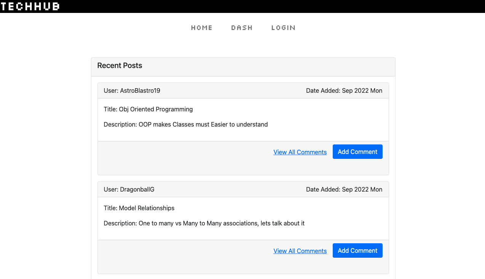

# Welcome to the TechHub!

## Table of Contents

- [Installation](#installation)

- [Check Out TechHub](#go-check-us-out)

- [License](#license)

- [Contact](#contact)

## Description

TechHub is one stop shop to discuss all things Tech! Get answers to technical questions, promote technologies you've had success with, and make industry connections.

## What Problem does TechHub Solve?

Open source information on all things tech, breeds better development and better output, no matter what skill level, and TechHub is supportive of this notion.

## Installation

### How to Use?

1. Run over to:
# https://lionsgatetech.herokuapp.com/login

2. Create an Account or Sign In 

3. Have at it! Create posts and comments related to Tech, connect with other Tech heads, learn and grow!

## Go Check us out

### Website 
## [TechHub - Powered by LionsGateTech](https://lionsgatetech.herokuapp.com)

### Demo Image: 

### Demo Links:

## [TechHub Demo - short](https://drive.google.com/file/d/1Optrt6LhdZ7DUyzLfFiwnrIc4p51dcOK/view)

## [TechHub Demo](https://watch.screencastify.com/v/tnmX53yFDaGQBVg01O3g)

## License

## Contact

### Email

[Contact Email](mailto:create.jasminedaniels@gmail.com)

### Github

[Github](https://github.com/JasmineDaniels)